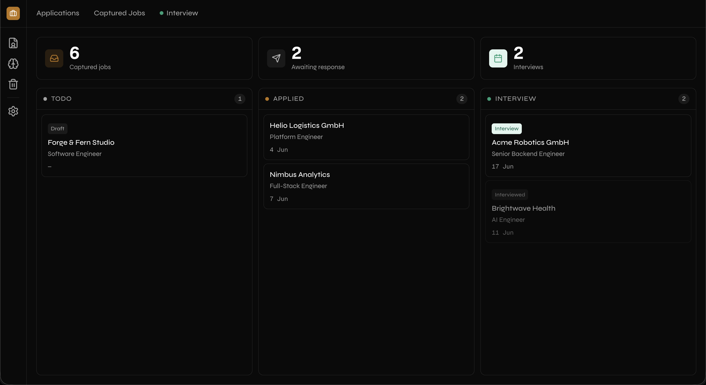
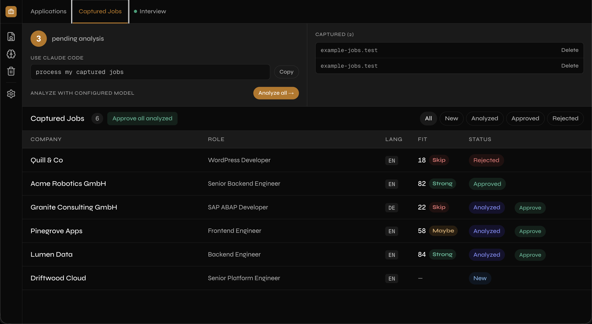
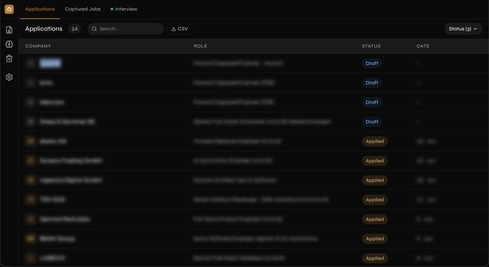
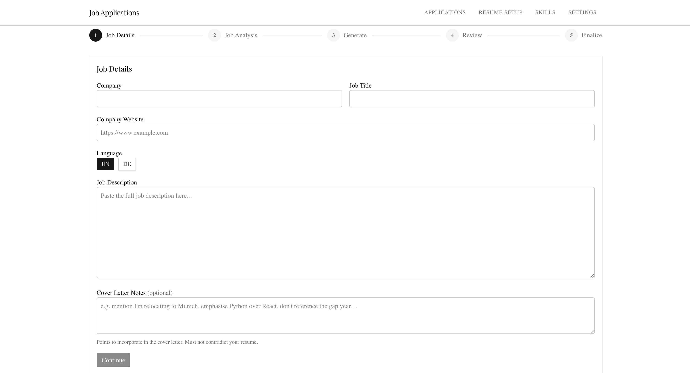
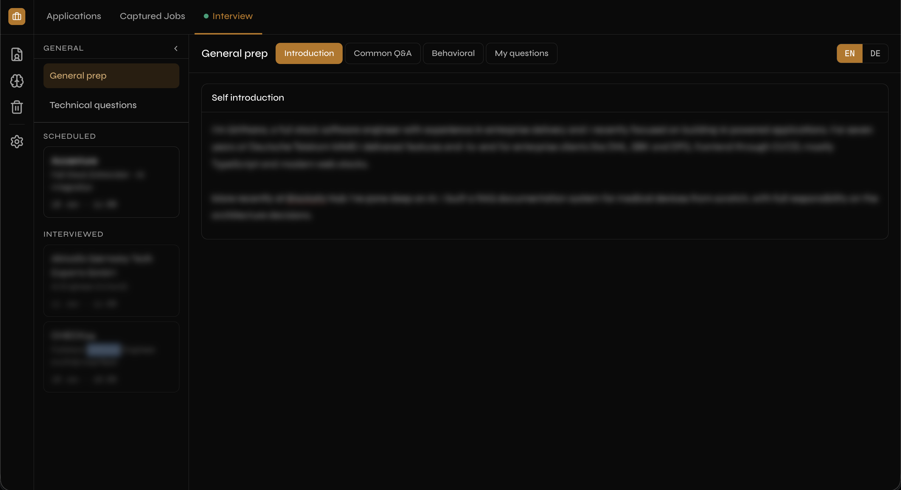
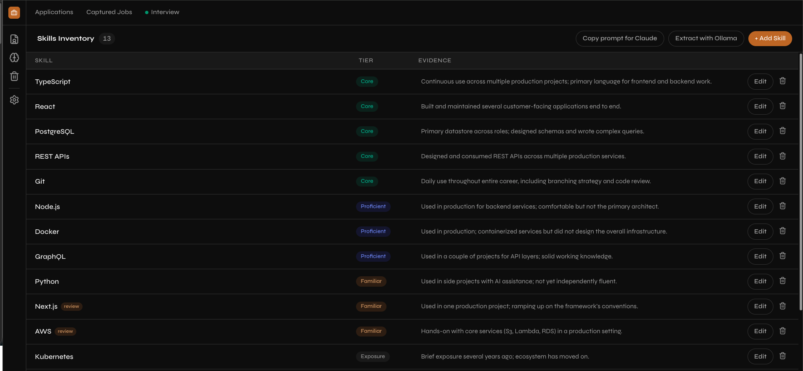
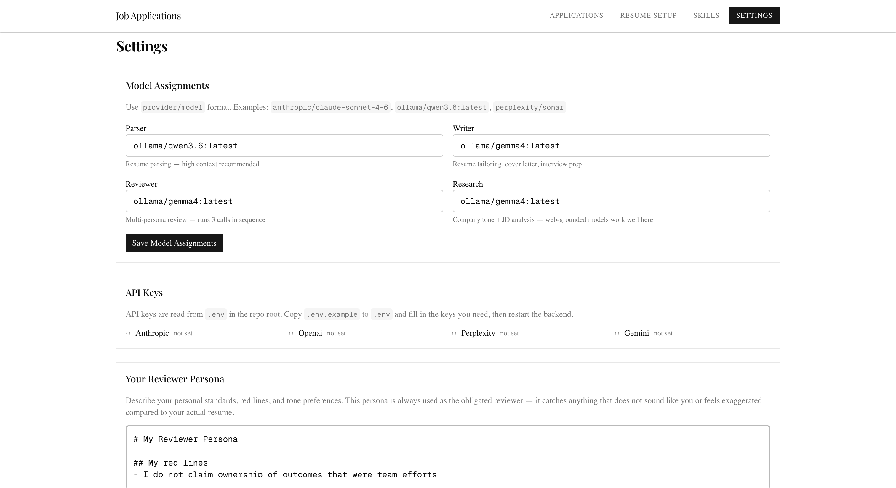

# Job Application System

An AI-assisted pipeline that captures job leads from any job board, analyzes fit before you commit, and produces a tailored one-page CV and cover letter (DOCX + PDF) for each application. Works with any combination of Ollama (local), Anthropic, OpenAI, Gemini, and Perplexity — assign a different model to each role (parser, writer, reviewer, research) and swap them from the UI without restarting.

---

## Screenshots

**Dashboard — kanban tracker (Todo / Applied / Interview) with capture & interview counts**



**Captured Jobs — triage leads with fit verdicts (Strong / Maybe / Skip) before approving**



**Applications — full list with search, status filter, and CSV export**



**Finalize — side-by-side review of the tailored resume and cover letter before export**



**Interview Prep — general prep, technical questions, and per-skill debrief**



**Skills Inventory — tiered skills with evidence for honest, tier-appropriate language**



**Settings — theme, font size, accent color, and per-role model assignments**



---

## How AI is used

The system has two distinct AI modes that can be mixed freely:

**Backend LLM roles** (automated paths in the web app — lead extraction, gap analysis, document generation, review, interview prep):
Configured per-role in **Settings** using `provider/model` format. Each role can use a different provider. Requires either [Ollama](https://ollama.ai) (free, local) or an API key for Anthropic / OpenAI / Gemini / Perplexity (`.env`).

**Claude Code paths** ("Copy prompt for Claude" buttons, "process my captured jobs", "process my skills"):
These run entirely inside [Claude Code](https://claude.ai/code) — the CLI tool included with Claude Pro and Max subscriptions. No API key needed. Claude Code reads the project context, calls the local backend's REST endpoints directly, and handles web research, interviewing you on ambiguous skills, and generating structured output. This is the higher-quality path for lead analysis and interview prep.

You can use either mode independently. A pure-Ollama setup works with no subscription. A Claude subscriber can use Claude Code for the high-touch tasks and skip API keys entirely for those paths.

## Requirements

- Python 3.11+
- Node.js 18+
- At least one LLM provider: [Ollama](https://ollama.ai) (local), an API key for Anthropic / OpenAI / Gemini / Perplexity, or a [Claude Pro/Max subscription](https://claude.ai) with Claude Code installed
- LibreOffice (for PDF export): `brew install --cask libreoffice`
- `pdfinfo` (for page count check): `brew install poppler`

## Setup

### Quick setup (macOS/Linux)

```bash
./setup.sh
```

This creates the Python virtualenv, installs backend and frontend dependencies, and seeds `.env` and `data/persona.md` / `data/skills.json` / `data/career_goal.md` from their `.example` counterparts (skipped if those files already exist).

### Manual setup

```bash
# Python dependencies
python -m venv .venv
source .venv/bin/activate
pip install -r app/backend/requirements.txt

# Frontend dependencies
cd app/frontend && npm install
```

Copy `.env.example` to `.env` and fill in any API keys you want to use:

```bash
cp .env.example .env
```

Seed the personal data files from their examples:

```bash
cp data/persona.example.md data/persona.md
cp data/skills.example.json data/skills.json
cp data/career_goal.example.md data/career_goal.md
```

## Running

Both processes must run simultaneously:

```bash
# Terminal 1 — backend
cd app/backend && source ../../.venv/bin/activate && uvicorn main:app --reload

# Terminal 2 — frontend
cd app/frontend && npm run dev
```

Open [http://localhost:3000](http://localhost:3000).

## Testing

```bash
# Backend unit + integration tests (no LLM or LibreOffice required)
cd app/backend && source ../../.venv/bin/activate && pytest

# Frontend type check
cd app/frontend && npx tsc --noEmit
```

CI (`.github/workflows/ci.yml`) runs the backend test suite and the frontend
type check on every push and pull request.

## First-time setup

1. Go to **Settings** → configure which model handles each role (parser / writer / reviewer / research) using `provider/model` format (e.g. `anthropic/claude-sonnet-4-6`, `ollama/qwen3.6:latest`).
2. Go to **Settings** → paste your persona description (your personal review guardrails).
3. Go to **Skills** → add your skills with tier ratings (1=Core, 2=Proficient, 3=Familiar, 4=Exposure) and evidence snippets. Or, once a master resume is uploaded (step 5), generate the inventory automatically: **Copy prompt for Claude** (Claude reads your resume and interviews you on anything ambiguous) or **Extract with Ollama** (one offline pass that flags low-confidence guesses for review) — both on the Setup and Skills pages. Re-running never overwrites edits you've made.
4. Drop your CV and cover letter DOCX templates into `templates/resume/` and `templates/cover-letter/`. The CV template holds your full resume layout; on export, only the **Profile summary** and **Skills** sections are replaced with the tailored content (located by their section heading text — `PROFESSIONAL SUMMARY` / `TECHNICAL SKILLS` in EN, `PROFIL` / `TECHNISCHE KENNTNISSE` in DE). Experience and other sections render straight from the template.
5. Go to **Setup** → upload your master resume (EN and/or DE). Your name is auto-extracted for PDF file naming. The resume is structured automatically on upload if an LLM parser model is configured. If none is available, the raw text is saved and the page offers a **Copy prompt for Claude** button to structure it via Claude Code instead.
6. Go to **Settings** → set your notice period (Immediately, 2 weeks, 1–6 months, or a custom date) — used to compute the availability date in generated cover letters.

## Browser extension

Load `browser-extension/` as an unpacked extension in Chrome (`chrome://extensions` → Load unpacked).

On any job board page, click the extension icon → **Capture Job**. The raw page text is saved instantly to the backend (no LLM delay). Run **Leads → Process captured** (or tell Claude Code to run `POST /api/leads/extract-captured`) to extract structured data in batch.

## Leads pipeline

Before committing to a full application, triage jobs in **Leads**:

1. Capture from the browser extension (or add manually).
2. **Analyze** — runs fit gap analysis (STRONG / HONEST / GAP per JD skill) + company tone research in parallel. Score 0–100, verdict strong / maybe / skip.
3. **Approve** → creates an Application in the tracker. **Reject** → dismisses.

## Application workflow (5-step wizard)

1. **Job Details** — paste the job description, set language and cover letter notes.
2. **Job Analysis** — auto-runs gap analysis (STRONG / HONEST / GAP) per JD skill against your skills inventory, ATS keywords, match score.
3. **Generate** — streams tailored resume + cover letter via SSE. Company tone is auto-detected and can be overridden.
4. **Review** — persona + 2 random expert reviewers score and rewrite both documents. Side-by-side panel: accept, edit, or skip each suggestion. Can be skipped entirely.
5. **Finalize** — edit final markdown, check cover letter word count, export DOCX + PDF. Note: only the resume's Profile summary and Skills sections round-trip into the exported CV; experience and other sections come from the template (see step 4 of First-run setup).

Output lands in `applications/[Company]/`.

## Trash

Deleting an application or a captured job moves it to **Trash** (sidebar icon, under Skills) instead of removing it immediately. From there you can **Restore** it back to its list, or **Delete forever** for a permanent removal.

## Structure

```
app/
  backend/          FastAPI + SQLite
    routers/        API routes (application, tracker, resume, settings, leads, trash)
    services/       analyzer, generator, reviewer, researcher, interview, pdf
      providers/    ollama, anthropic, openai, perplexity, gemini
    office/         unpack.py / pack.py — DOCX ZIP editing helpers
    config.toml     Default model slugs and file paths
  frontend/         Next.js 16
    app/            Pages: /, /setup, /skills, /trash, /leads, /leads/[id],
                           /apply/new, /apply/[id], /settings
    components/     ReviewPanel, Nav, shared UI
browser-extension/  Chrome Manifest V3 — one-click job capture
data/               persona.md, skills.json  (gitignored — see examples/)
templates/          Base DOCX files  (gitignored, .gitkeep preserves folders)
applications/       Per-company output folders  (gitignored)
resume_master.md    Canonical EN resume  (source of truth, never modify)
resume_master_de.md Canonical DE resume
```

## Notes

- The CV **must be exactly 1 page**. The backend enforces this with a `pdfinfo` check and returns HTTP 422 if it overflows.
- Model assignments are stored in the database and editable from **Settings** — no restart required.
- Cover letter availability dates are never "ab sofort" — they're computed from your **Settings → Availability** notice period (rounded up to the 1st of a month) or a custom date you choose.
- `data/` and `applications/` are gitignored. See `data/persona.example.md` and `data/skills.example.json` for the expected format.
